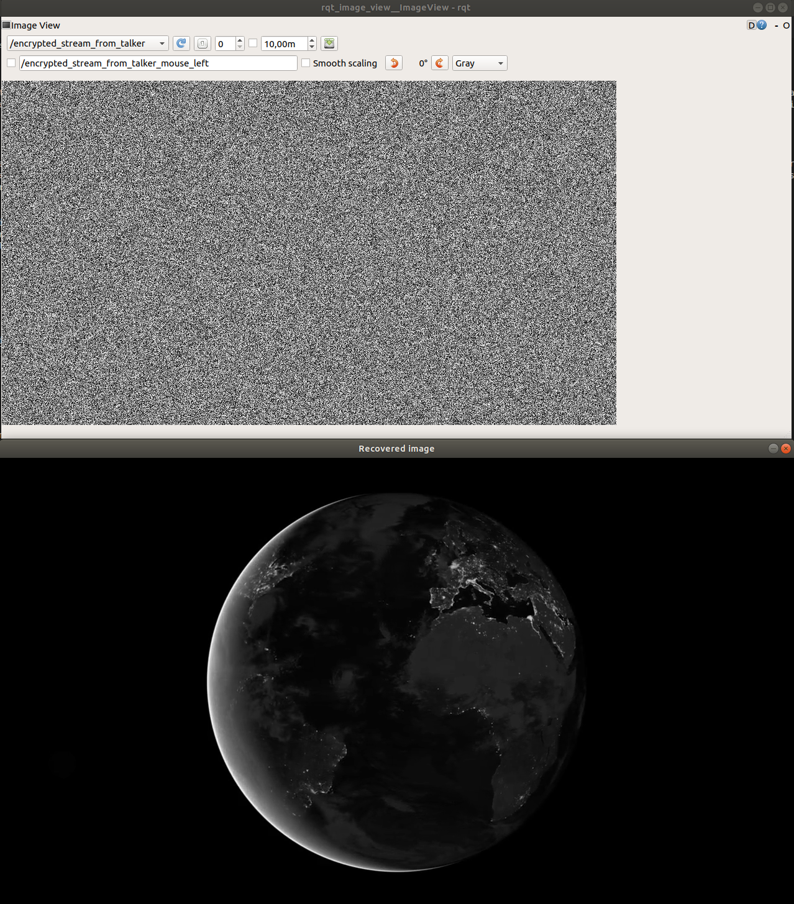

# Real-time encryption of sensor signals in autonomous systems

## Overview
This repo contains source code and instructions to interface C++ implemetations of [cryptographical algorithms](https://github.com/pettsol/CryptoToolbox) for different sensor data such as

* images / video stream
* point cloud
* control signals

By following the instructions, you should be able to create an efficient pipeline to transfer different types of sensor data securely across machines in real-time. I.e., sensor data is encrypted during transfer and only decrypted at end-points. Authentication algorithms from the toolbox is also included to ensure that data is not changed during transfer.

We use [Robot Operating System](https://www.ros.org/) (ROS) as a software platform to handle sensor interfacing and low-level communication between nodes (either locally on one single machine or across multiple machines). This simplfies the task of applying the [cryptographical toolbox](https://github.com/pettsol/CryptoToolbox) of algorithms for different sensor data significantly. Fortunately, ROS also offers point cloud and image libraries to interface and visualize lidar and camera data.  
 
This repo is in fact a ROS package which can easily be integrated into a ROS environment applied by new users. It is tested with Ubuntu 18.04 LTS and ROS melodic, on x86 architecture (standard laptop), arm-based 64-bit architecture (Nvidia Jetson Xavier) and arm-based 32-bit architecture (Rasberry Pi).

### Structure
In the crypto_pipeline/src folder, each application folder is listed and under each application folder, each cryptographical method in use is listed. In CMakeLists.txt, one can easily comment/uncomment executives representing the different cryptological methods applied to different sensor data (video, pointcloud or control signals). Remember to only include one pair of executive at the time, 1 x "talker" - the ROS node to send data and 1 x "listener" - the ROS node to receive data. For simplicity, all internal crypto libraries neccessary for each application is stored locally. This may be changed later.

## Examples

Two applications is shown below. First, encrypted video stream as well as recovered video at end-points using AES 128-bit in cipher feedback mode.

 Then, the second screenshot shows the recovered point cloud using HC-128 and authentication (HMAC-SHA-256). We have not found any way to visualize an encrypted point cloud yet. However, original point cloud data is printed to the upper terminal while its encrypted point version is shown in the lower one.  

## Installation

### Dependencies

**ROS**

This software is built on ROS, which needs to be installed first.

- If you use a standard PC with x86 architecture, follow the instructions here: http://wiki.ros.org/melodic/Installation/Ubuntu. Full-desktop version is recommended if disk-space is not critical.

- For arm-based Nvidia Jetson Xavier:

      git clone https://github.com/jetsonhacks/installROSXavier
      cd installROSXavier
      ./installROS.sh -p ros-melodic-desktop-full
      
This repo also provide a quick solution to setup a catkin workspace by running the command:

	./setupCatkinWorkspace.sh
	
More instructions on how to setup a Nvidia Jetson Xavier from scratch is included in the documentation folder. Here, some aspects to consider when sending ROS messages across multiple machines is also included. 

**OpenCV**

In addition, to be able to run the image/video encryption examples, this ROS package depends on [OpenCV](http://opencv.org/) (computer vision library)

- For standard laptops, installation instructions from here is recommended: https://www.pyimagesearch.com/2018/05/28/ubuntu-18-04-how-to-install-opencv/.

- For Jetson Xavier:

    git clone https://github.com/AastaNV/JEP
    cd scripthttp://docs.ros.org/melodic/api/sensor_msgs/html/msg/Image.html
    ./install_opencv4.1.1_Jetson.sh.

NB 1: We now provide examples which are independent of OpenCV. These examples use sensor_msgs/Image topics only (recorded from a rosbag) which means there is no need for reading/capturing or bridging functinality provided by openCV.    

NB 2: There has been some issues when combining ROS melodic and OpenCV <= 4.x.x, so it may be safe to install OpenCV <= 3.4.x. We installed 3.4.3 by simply changing 4.1.1 with 3.4.3 everywhere in the sh file (install_opencv4.1.1_Jetson.sh).

### Create catkin workspace

Now, create a catkin workspace and include our ROS package as well as ROS package for bridging opencv and ROS (vision_opencv):

    mkdir -p catkin_ws/src
    cd catkin_ws/src
    git clone https://github.com/oysteinvolden/Real-time-sensor-encryption.git
    git clone https://github.com/ros-perception/vision_opencv.git 
    cd ..
    catkin_make -DCMAKE_BUILD_TYPE=Release

Building in release mode makes sure you maximize performance. 

## Basic Usage

### Run the publisher and the subscriber

Open a terminal and type:

    roscore
Open a second terminal and:
	
    cd ~/catkin_ws
    source devel/setup.bash
    rosrun crypto_pipeline talker
Open a third terminal and:

    cd ~/catkin_ws
    source devel/setup.bash
    rosrun crypto_pipeline listener

Remember to enable the pair of executives in use and uncomment all other executives. These are found in CMakelists.txt inside the crypto_pipeline folder. 

### ROS topics

**Images**

* **`/camera_array/cam0/image_raw`** ([sensor_msgs/Image])

Original image data from a FLIR blackfly S camera recorded with a rosbag. Rosbag is a powerful ROS tool used to record various sensor measurements.

* **`/encrypted_stream_from_talker`** ([sensor_msgs/Image])

* **`/recovered_stream_listener`** ([sensor_msgs/Image])

* **`/encrypted_stream_from_listener`** ([sensor_msgs/Image])

* **`/recovered_stream_talker`** ([sensor_msgs/Image])

    Encrypted and recovered image topics. Documentation is found [here](http://docs.ros.org/melodic/api/sensor_msgs/html/msg/Image.html). 
  
**Point cloud**

* **`/os1_cloud_node/points`** ([sensor_msgs/Pointcloud2])

    Original point cloud data from an Ouster Os1 lidar recorded with a rosbag. 

* **`/encrypted_points_from_talker`** ([sensor_msgs/Pointcloud2])

* **`/recovered_points_listener`** ([sensor_msgs/Pointcloud2])

* **`/encrypted_points_from_listener`** ([sensor_msgs/Pointcloud2])

* **`/recovered_points_talker`** ([sensor_msgs/Pointcloud2])

    Encrypted and recovered point cloud topics. Documentation is found [here](http://docs.ros.org/melodic/api/sensor_msgs/html/msg/PointCloud2.html).

**Control signals**

- ROS topics for control signals comes later

### Handy ROS tools
	
Check topics pulished:

    rostopic list -v
Check content of topics published:

    rostopic echo /topic_name
Check frequency:

    rostopic hz /topic_name
Visualize image topic:

    rqt_image_view
Visualize point cloud:

    rviz

Then change frame to "os1_lidar" and add topic of interest. 

# TODO List

A preliminary list of whats left:

- measure RTT correct 

- Add documentation for nvidia setup and network/communication aspects. 

- Control signals: AES cipher feedback mode?

**Credit: The ROS package is heavily based on the [toolbox](https://github.com/pettsol/CryptoToolbox) containing C-style cryptographical algorithms implemented by [Petter Solnoer](https://www.ntnu.no/ansatte/petter.solnor).**

**Authors: [Oystein Volden](https://www.ntnu.no/ansatte/oystv), oystein.volden@ntnu.no and [Petter Solnoer](https://www.ntnu.no/ansatte/petter.solnor), petter.solnor@ntnu.no**
