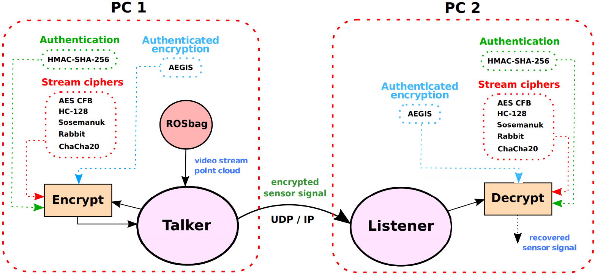
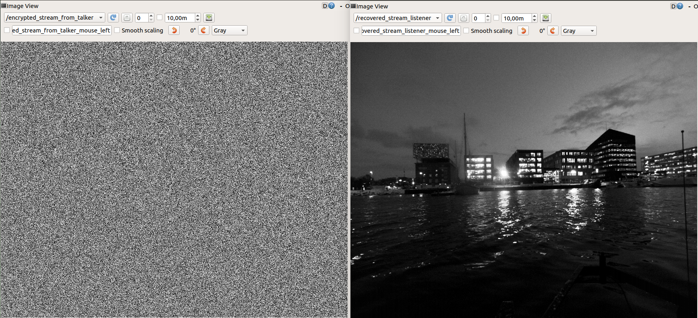

# Crypto ROS: Secure and Efficient Transmission of Vision-Based Feedback Control Signals

## Overview
This repo contains source code and instructions to interface C-style C++ implemetations of [cryptographic algorithms](https://github.com/pettsol/CryptoToolbox) for various sensor data in ROS. More specific, you should be able to create an efficient pipeline to transfer image and point cloud data securely across machines / ROS nodes in real-time when following the instructions.

Please include the following reference when you use the toolbox:
Ø. Volden and P. Solnør (2020)."Crypto ROS: Real-time authenticated encryption of vision-based sensor signals in ROS". URL: https://github.com/oysteinvolden/Real-time-sensor-encryption

Bibtex entry:
@misc{VoldenCryptoROS2020,
  title = {{Crypto ROS}: Real-time authenticated encryption of vision-based sensor signals in {ROS}},
  author = {{{\O}}. Volden and P. Soln{\o}r},
  howpublished = {\url{https://github.com/oysteinvolden/Real-time-sensor-encryption}},
  year = {2020}
}

**Credit: This ROS package is heavily based on the [toolbox](https://github.com/pettsol/CryptoToolbox) containing C-style cryptographic algorithms implemented by [Petter Solnoer](https://www.ntnu.no/ansatte/petter.solnor).**

**Authors: [Oystein Volden](https://www.ntnu.no/ansatte/oystv), oystein.volden@ntnu.no and [Petter Solnoer](https://www.ntnu.no/ansatte/petter.solnor), petter.solnor@ntnu.no**

The implementation can be summarized by the following list:

* All SW-oriented stream ciphers from the eSTREAM portfolio (profile 1)
* AES in cipher feedback mode (CFB)
* HMAC + SHA-256 for authentication
* 'Encrypt-then-MAC' schemes: Rabbit + HMAC and HC-128 + HMAC
* AEGIS (dedicated athenticated encryption algorithm) 
* Hardware accelerated variant of AEGIS and AES-CFB suitable for ARM-based architectures (armv8) such as Nvidia Jetson Xavier. 
* 'Compress-then-encrypt' schemes: JPEG + AEGIS and PNG + AEGIS

We use [Robot Operating System](https://www.ros.org/) (ROS) as a software platform to handle sensor interfacing and low-level communication between ROS nodes (either locally on one single machine or across multiple machines), thus simplfying the task of applying the [cryptographic toolbox](https://github.com/pettsol/CryptoToolbox) of algorithms for different sensor data. This repo is in fact a ROS package which can easily be integrated into a ROS environment applied by new users. It is tested with Ubuntu 18.04 LTS and ROS melodic, on x86 architecture (standard laptop), arm-based 64-bit architecture (Nvidia Jetson Xavier) and arm-based 32-bit architecture (Rasberry Pi).

### Structure
For each application folder (i.e. video and point cloud) in the crypto_pipeline/src folder, a number of cryptographic methods are included. In CMakeLists.txt, one can easily comment/uncomment executives representing the different cryptographic methods applied to different sensor data. Remember to only include one pair of executive at the time, 1 x "talker" - the ROS node to send encrypted data and 1 x "listener" - the ROS node to receive encrypted data. For simplicity, all cryptographic libraries neccessary for each application is stored locally. This may be changed later.

## Examples

Two applications is shown below. The first example shows an encrypted video stream before it is recovered by using AES 128-bit in cipher feedback mode, implemented in ROS.

The second example shows the recovered point cloud using HC-128 and authentication (HMAC-SHA-256) in an 'Encrypt-then-MAC' composition. We have not found any way to visualize an encrypted point cloud yet. The original point cloud data is however printed to the uppermost terminal while its encrypted point version is shown in the lowermost.  

## Installation

### Dependencies

**ROS**

This software is built on ROS, which needs to be installed first.

- If you use a standard PC with x86 architecture, follow the instructions here: http://wiki.ros.org/melodic/Installation/Ubuntu. Full-desktop version is recommended if disk-space is not critical.

- For arm-based Nvidia Jetson Xavier:

      git clone https://github.com/jetsonhacks/installROSXavier
      cd installROSXavier
      ./installROS.sh -p ros-melodic-desktop-full
      
This repo also provide a quick solution to setup a catkin workspace by running the command:

	./setupCatkinWorkspace.sh
	
More instructions on how to setup a Nvidia Jetson Xavier from scratch is included in the documentation folder. Here, some aspects to consider when sending ROS messages across multiple machines is also included. 

**OpenCV**

In addition, to be able to run the image/video encryption examples, this ROS package depends on [OpenCV](http://opencv.org/) (computer vision library)

- For standard laptops, installation instructions from here is recommended: https://www.pyimagesearch.com/2018/05/28/ubuntu-18-04-how-to-install-opencv/.

- For Jetson Xavier:

    git clone https://github.com/AastaNV/JEP
    cd script
    ./install_opencv4.1.1_Jetson.sh.

NB 1: We now provide examples which are independent of OpenCV. These examples use sensor_msgs/Image topics only (recorded from a rosbag) which means there is no need for reading/capturing or bridging functinality provided by openCV. An example including image compression and authenticated encryption is however still dependent of openCV.   

NB 2: There has been some issues when combining ROS melodic and OpenCV <= 4.x.x, so it may be safe to install OpenCV <= 3.4.x. We installed 3.4.3 by simply changing 4.1.1 with 3.4.3 everywhere in the sh file (install_opencv4.1.1_Jetson.sh).

### Create catkin workspace

Now, create a catkin workspace and include our ROS package as well as ROS package for bridging opencv and ROS (vision_opencv):

    mkdir -p catkin_ws/src
    cd catkin_ws/src
    git clone https://github.com/oysteinvolden/Real-time-sensor-encryption.git
    git clone https://github.com/ros-perception/vision_opencv.git 
    cd ..
    catkin_make -DCMAKE_BUILD_TYPE=Release

Building in release mode makes sure you maximize performance. 

## Basic Usage

### Run the publisher and the subscriber

Open a terminal and type:

    roscore
Open a second terminal and:
	
    cd ~/catkin_ws
    source devel/setup.bash
    rosrun crypto_pipeline talker
Open a third terminal and:

    cd ~/catkin_ws
    source devel/setup.bash
    rosrun crypto_pipeline listener

Remember to enable the pair of executives in use and uncomment all other executives. These are found in CMakelists.txt inside the crypto_pipeline folder. 

### ROS topics

**Images**

* **`/camera_array/cam0/image_raw`** ([sensor_msgs/Image])

Original image data from a FLIR blackfly S camera recorded with a ROSbag. 

* **`/encrypted_stream_from_talker`** ([sensor_msgs/Image])

* **`/recovered_stream_listener`** ([sensor_msgs/Image])

    Encrypted and recovered image topics. Documentation is found [here](http://docs.ros.org/melodic/api/sensor_msgs/html/msg/Image.html). 
  
**Point cloud**

* **`/os1_cloud_node/points`** ([sensor_msgs/Pointcloud2])

    Original point cloud data from an Ouster Os1 lidar recorded with a ROSbag. 

* **`/encrypted_points_from_talker`** ([sensor_msgs/Pointcloud2])

* **`/recovered_points_listener`** ([sensor_msgs/Pointcloud2])

    Encrypted and recovered point cloud topics. Documentation is found [here](http://docs.ros.org/melodic/api/sensor_msgs/html/msg/PointCloud2.html).

### Customize for other data types
To customize for other datatypes, simply include the relevant ROS headers and the corresponding sensor type in the source code, i.e., in the talker.cpp and listener.cpp files for each application. 

### Dataset
The following link shows the dataset used for experimental testing. Link: https://drive.google.com/file/d/1r-2hCOiP4Ok0N0HTnC6VNMzrjIawA-yZ/view?usp=sharing

* /camera_array/cam0/image_raw
* /os1_cloud_node/points 

### Handy ROS tools
	
Check topics pulished:

    rostopic list -v
Check content of topics published:

    rostopic echo /topic_name
Check frequency:

    rostopic hz /topic_name
Visualize image topic:

    rqt_image_view
Visualize point cloud:

    rviz

Then change frame to "os1_lidar" and add topic of interest. 

